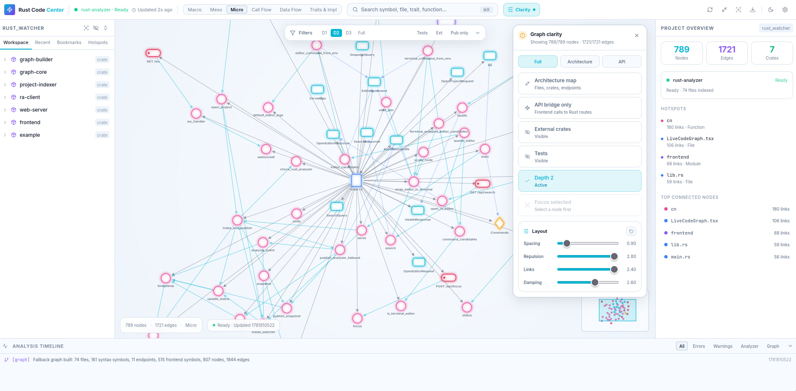

# Rust Code Command Center

Local browser app for exploring Rust and React/TypeScript projects as a live code graph.



## What It Does

- Builds an interactive graph of crates, files, modules, symbols, calls, traits, impls, React components, hooks, and API routes.
- Connects frontend API calls to Rust backend endpoints when both sides are in the same project.
- Provides graph modes for macro/meso/micro views, call flow, data flow, and trait/impl relationships.
- Includes depth filters, focus bubbles, graph clarity presets, light/dark themes, and layout tuning.

## Setup

Install and build the frontend:

```bash
cd frontend
pnpm install
pnpm build
```

Build the Rust workspace:

```bash
cargo build
```

## Analyzer Setup

Rust Code Command Center works with parser fallbacks, but external analyzers unlock richer semantic data.

Rust:

- Required for semantic Rust symbols, diagnostics, call hierarchy, references, definitions, and type definitions: `rust-analyzer`
- Install with Rustup:

```bash
rustup component add rust-analyzer
```

Package-manager installs are also fine when your platform provides `rust-analyzer`.

Python:

- Optional semantic analyzer: `ty`
- Install examples:

```bash
uv tool install ty
cargo install ty
```

Platform/package-manager installs are also fine when available. In `auto` mode, missing `ty` is not fatal; the Python parser fallback remains active.

TypeScript/JavaScript:

- Optional semantic analyzers: `typescript` and `typescript-language-server`
- Preferred local install:

```bash
cd frontend
pnpm add -D typescript typescript-language-server
```

The backend automatically checks project `node_modules/.bin`, parent `node_modules/.bin`, this repository's `frontend/node_modules/.bin`, and then `PATH`. Avoid `sudo npm -g` as the default setup; local project installs are more portable.

QML:

- The QML parser works without external tools.
- Optional semantic analyzer: `qmlls`
- `qmlls` is installed with Qt and is usually under `<Qt installation>/bin/qmlls`. You can pass an explicit path with `--qmlls-path`.
- If your QML project needs build information, pass it with `--qmlls-build-dir /path/to/build`.
- `--qmlls-no-cmake-calls` is enabled by default to avoid surprising rebuild/configure steps.
- `qmlls` is still evolving and may need build information for accurate module/type resolution.

Analyzer mode flags:

- `--python-analyzer auto|parser|ty`
- `--ty-path /path/to/ty`
- `--disable-ty`
- `--typescript-analyzer auto|parser|typescript-language-server`
- `--typescript-language-server-path /path/to/typescript-language-server`
- `--disable-typescript-language-server`
- `--qml-analyzer auto|parser|qmlls`
- `--qmlls-path /path/to/qmlls`
- `--disable-qmlls`
- `--qmlls-build-dir /path/to/build`
- `--qmlls-no-cmake-calls`
- `--rust-analyzer /path/to/rust-analyzer`

## Run A Project

Index any local project and open the browser UI:

```bash
cargo run -p web-server -- serve --project /path/to/rust/project --open
```

If `--project` is omitted, the server indexes the current working directory.
The default host is `127.0.0.1`; `--port 0` picks a free local port.

## Frontend Development

Run the backend on the Vite proxy port, then start Vite:

```bash
cargo run -p web-server -- serve --project /path/to/rust/project --port 34127
cd frontend
pnpm dev
```

Override the backend proxy target with `VITE_BACKEND_URL` when needed.

## API

- `GET /api/health`
- `GET /api/status`
- `GET /api/graph/snapshot?mode=Macro`
- `GET /api/node/:id`
- `GET /api/search?q=query`
- `POST /api/focus`
- `POST /api/project/open`
- `GET /ws`

The app never exposes file mutation, deletion, shell execution, or write APIs.
